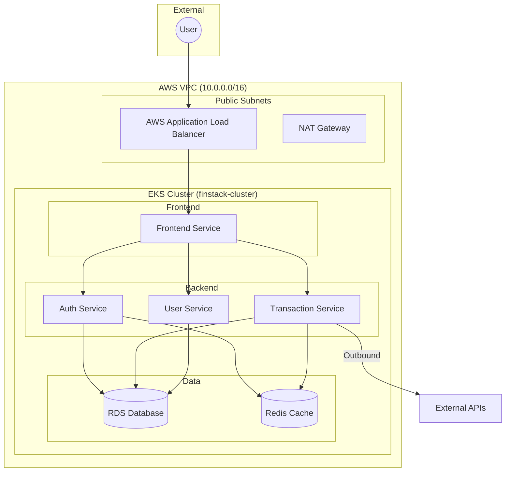

# Finstack System Architecture (EKS Edition)

This document describes the high-level architecture of the Finstack platform, a microservices-based financial application deployed on **AWS EKS (Elastic Kubernetes Service)** using Terraform and EKS Managed Node Groups.

## 1. High-Level Design

The system follows a **Cloud-Native Microservices** pattern, where each functional area is isolated into its own Kubernetes Deployment. All services are deployed in **Private Subnets** using **EKS Managed Node Groups**, providing scalable EC2-based compute with auto-scaling capabilities.

### Architecture Diagram

---

## 2. Infrastructure Components

### **Networking & Connectivity**
*   **VPC**: Isolated network boundary with a `10.0.0.0/16` CIDR block.
*   **Subnets**:
    *   **Public**: Hosts the **Managed ALB** and NAT Gateway.
    *   **Private**: Hosts all EKS worker node EC2 instances.
*   **Ingress Controller**: **AWS Load Balancer Controller** automatically provisions the ALB based on the `finstack-ingress` resource.
*   **Service Discovery**: Uses **Kubernetes Native DNS** (CoreDNS) for internal resolution (e.g., `http://finstack-auth-service:4000`).

### **Compute (EKS Managed Node Groups)**
All services run on **EKS Managed Node Groups**, providing EC2-based Kubernetes compute.
*   **Instance Type**: `t3.medium` (configurable via Terraform variables).
*   **Auto-Scaling**: Min 1, Desired 2, Max 4 nodes across 2 Availability Zones.
*   **Logging**: Integrated with **Fluent Bit** DaemonSet to stream logs to CloudWatch.

---

## 3. Security Model (Production-Grade)

The architecture uses **IAM Roles for Service Accounts (IRSA)** for secure AWS API access and granular Security Groups:

| Component | Ingress Source | Allowed Port |
| :--- | :--- | :--- |
| **ALB** | Everywhere (0.0.0.0/0) | 80, 443 |
| **Worker Nodes** | Managed by K8s Services & Cluster SG | 80, 3000, 4000-4004 |

> [!IMPORTANT]
> **Zero Trust Internal Networking**: Services communicate using internal ClusterIPs. The API Gateway is the only backend service exposed to the ALB.

---

## 4. Microservices Catalog

| Service | Port | Responsibilities |
| :--- | :--- | :--- |
| **Frontend** | 80 | User Interface (React/Next.js) |
| **API Gateway** | 3000 | Routing, Auth delegation, Load balancing |
| **Auth Service** | 4000 | User Authentication & Registration |
| **User Service** | 4001 | Profile management |
| **Payment Service** | 4002 | Transaction processing |
| **Notification** | 4003 | Multi-channel alerts |
| **Transaction** | 4004 | Ledger management (MongoDB) |

---

## 5. Deployment & CI/CD
*   **Infrastructure**: Managed by [Terraform](file:///home/gitops/Desktop/finstack/infra/) (VPC, EKS, IAM, Helm).
*   **Application**: Managed by [Kubernetes Manifests](file:///home/gitops/Desktop/finstack/k8s/) (organized into `deployments/`, `services/`, and `ingress/`).
*   **CI/CD**: GitHub Actions builds Docker images and pushes to Docker Hub.
