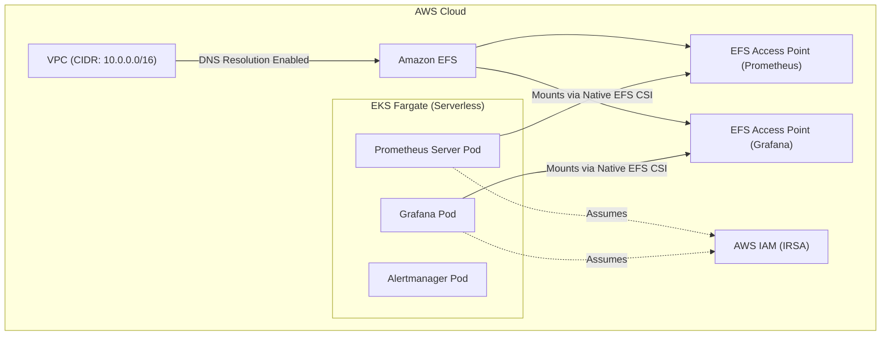

# Enterprise Serverless Observability on EKS Fargate

## 1. Project Objective
The goal was to architect and deploy a **Production-Ready, Persistent Observability Stack (Prometheus & Grafana)** on **AWS EKS Fargate**. 

**Why Fargate?** 
To achieve a completely serverless Kubernetes compute environment, eliminating EC2 node patching, AMI upgrades, and OS-level maintenance. 

**The Challenge:**
Fargate is inherently stateless and temporary. However, metric data (Prometheus Tsdb) and dashboards (Grafana SQLite) require persistent storage that survives pod restarts and upgrades. Building stateful workloads on stateless compute requires deep AWS infrastructure integration, specifically utilizing **Amazon EFS (Elastic File System)** instead of standard EBS volumes.

---

## 2. Technical Architecture

### Core Components
*   **Compute:** AWS EKS Fargate Profiles bounding the `monitoring` namespace.
*   **Storage Backend:** Amazon EFS (NFSv4.1) replacing traditional EBS (which is unsupported on Fargate).
*   **Access Control:** AWS IAM Roles for Service Accounts (IRSA) enforcing least-privilege security.
*   **Monitoring Applications:** Prometheus Server & Alertmanager (via Prometheus Community Helm Chart) and Grafana.

### Flow Diagram

---

## 3. How We Built It (Implementation Sequence)

### Phase 1: Infrastructure Provisioning (Terraform)
1.  **EFS File System:** Created a high-availability EFS filesystem spanning multiple Availability Zones.
2.  **EFS Security Groups:** Configured ingress to allow NFS traffic (Port 2049) originating from the VPC CIDR.
3.  **EFS Access Points:** Created dedicated POSIX-compliant Access Points for Prometheus (`/prometheus`), Grafana (`/grafana`), and Alertmanager (`/alertmanager`). This enforces strict directory ownership (`472:472` for Grafana, `65534:65534` for Prometheus) natively, bypassing Kubernetes `initContainer` privilege requirements.
4.  **IAM Integration (IRSA):** Created an IAM role (`AmazonEFSCSIDriverPolicy`) and established a trust relationship with the EKS OIDC provider mapped directly to the Kubernetes Service Accounts.

### Phase 2: Kubernetes Configuration (Manifests & Helm)
1.  **StorageClass:** Created a custom `efs-sc` StorageClass.
2.  **Static Provisioning:** Because Fargate doesn't support Dynamic Provisioning, we manually mapped `PersistentVolumes` (PVs) using the EFS Volume Handle (File System ID + Access Point ID).
3.  **Helm Chart Customization:** Configured the `prometheus` and `grafana` Helm values to link to our custom Service Accounts, set matching PVC sizes (20Gi, 10Gi, 2Gi), and injected the correct StorageClass bindings.

---

## 4. Problems Faced & Engineering Solutions

Building this stack exposed several advanced, enterprise-level caveats specific to Fargate. Here is exactly what failed, why, and how we resolved it.

> [!WARNING] 
> **Challenge 1: The EFS CSI Plugin vs. Fargate Architecture**
> 
> * **Symptom:** Pods were stuck in `Pending` or emitting `driver name efs.csi.aws.com not found` errors.
> * **Root Cause:** Standard EFS CSI drivers deploy a `DaemonSet` (node plugin) requiring `privileged: true` permissions. Fargate forbids both DaemonSets and privileged containers. We initially attempted to install the standard EFS Helm Add-on, which resulted in a `DEGRADED` state because the node agent couldn't schedule.
> * **The Fix:** We completely removed the manual CSI deployment. **Fargate natively intercepts and mounts EFS**. As long as the basic `CSIDriver` object exists and PVCs are properly formatted for static provisioning, the AWS hypervisor handles the mount transparently without node-level agents.

> [!IMPORTANT]
> **Challenge 2: Hidden VPC Networking & Fargate Security Groups**
> 
> * **Symptom:** `FailedMount` with error `Failed to resolve fs-xxx.efs.eu-north... connection refused`.
> * **Root Cause 1 (DNS):** The VPC lacked `EnableDnsHostnames`, causing the implicit EFS DNS string to fail resolution inside the Pod's isolated network space.
> * **Root Cause 2 (Security Groups):** We initially allowed inbound EFS traffic only from a custom `eks_cluster_sg`. However, Fargate ENIs (Elastic Network Interfaces) default strictly to the EKS-managed implicit Cluster Security Group unless modified via Security Group Policies.
> * **The Fix:** Enabled VPC DNS Hostnames globally in AWS, and widened the EFS Mount Target Security Group ingress to accept NFS traffic (2049) from the entire `vpc.cidr_block` (`10.0.0.0/16`).

> [!CAUTION]
> **Challenge 3: Distributed Network Filesystems & SQLite (`Database is Locked`)**
> 
> * **Symptom:** Grafana was continually crashing (`CrashLoopBackOff`) with the log output: `Database locked, sleeping then retrying`.
> * **Root Cause:** Grafana uses a local `sqlite3` database. Kubernetes Deployments default to a `RollingUpdate` strategy (`25% maxSurge`), meaning the scheduler spins up the *new* pod before shutting down the *old* one. Because both Fargate pods were connecting to the *same* EFS distributed file, they encountered race conditions locking the SQLite file (SQLite does not support concurrent multi-pod writers over NFS).
> * **The Fix:** We edited the Grafana Helm Deployment strategy to `Recreate`. This forces Kubernetes to successfully terminate the old container (dropping the filesystem lock) before booting the new one, restoring complete stability to Grafana on EFS.

---

## 5. Summary
By overcoming these deep infrastructural nuances (Fargate Native storage paths, VPC DNS resolution, ENI security bindings, and NFS POSIX file-locking constraints), we proved that **stateful, data-heavy applications can run flawlessly on a 100% serverless Kubernetes data plane**.
