# Enterprise Observability on EKS — Architecture Document

## 1. Project Objective
The goal was to architect and deploy a **Production-Ready, Persistent Observability Stack (Prometheus & Grafana)** on **AWS EKS with Managed Node Groups**.

As part of the larger **ECS (Fargate) → EKS migration**, we needed a comprehensive monitoring solution that leverages the full Kubernetes ecosystem — something that wasn't achievable on ECS.

**The Challenge:**
Metric data (Prometheus TSDB) and dashboards (Grafana SQLite) require persistent storage that survives pod restarts and upgrades. We utilized **Amazon EFS (Elastic File System)** for shared, multi-AZ persistent storage across the monitoring stack.

---

## 2. Technical Architecture

### Core Components
*   **Compute:** AWS EKS Managed Node Groups (`t3.medium`, auto-scaling 1-4 nodes) running workloads in the `monitoring` namespace.
*   **Storage Backend:** Amazon EFS (NFSv4.1) providing shared, persistent storage across multiple Availability Zones.
*   **Logging:** FluentBit DaemonSet → Amazon CloudWatch Logs.
*   **Access Control:** AWS IAM Roles for Service Accounts (IRSA) enforcing least-privilege security.
*   **Monitoring Applications:** Prometheus Server & Alertmanager (via Prometheus Community Helm Chart) and Grafana.

### Flow Diagram

```mermaid
graph TD;
    subgraph "AWS Cloud"
        VPC["VPC (CIDR: 10.0.0.0/16)"]
        EFS["Amazon EFS"]
        CW["Amazon CloudWatch Logs"]
        EFS_AP_PROM["EFS Access Point (Prometheus)"]
        EFS_AP_GRAF["EFS Access Point (Grafana)"]
        
        subgraph "EKS Managed Node Groups"
            PROM["Prometheus Server Pod"]
            GRAF["Grafana Pod"]
            ALERT["Alertmanager Pod"]
            FB["FluentBit DaemonSet"]
        end
        
        IAM["AWS IAM (IRSA)"]
    end
    
    VPC -->|DNS Resolution Enabled| EFS
    EFS --> EFS_AP_PROM
    EFS --> EFS_AP_GRAF
    
    PROM -->|Mounts via EFS CSI Driver| EFS_AP_PROM
    GRAF -->|Mounts via EFS CSI Driver| EFS_AP_GRAF
    FB -->|Ships Logs| CW
    
    PROM -.->|Assumes| IAM
    GRAF -.->|Assumes| IAM
```

---

## 3. How We Built It (Implementation Sequence)

### Phase 1: Infrastructure Provisioning (Terraform)
1.  **EFS File System:** Created a high-availability EFS filesystem spanning multiple Availability Zones.
2.  **EFS Security Groups:** Configured ingress to allow NFS traffic (Port 2049) originating from the VPC CIDR.
3.  **EFS Access Points:** Created dedicated POSIX-compliant Access Points for Prometheus (`/prometheus`), Grafana (`/grafana`), and Alertmanager (`/alertmanager`). This enforces strict directory ownership (`472:472` for Grafana, `65534:65534` for Prometheus) natively.
4.  **IAM Integration (IRSA):** Created an IAM role (`AmazonEFSCSIDriverPolicy`) and established a trust relationship with the EKS OIDC provider mapped directly to the Kubernetes Service Accounts.

### Phase 2: Kubernetes Configuration (Manifests & Helm)
1.  **StorageClass:** Created a custom `efs-sc` StorageClass.
2.  **EFS CSI Driver:** Deployed the standard EFS CSI driver via Helm — runs as a DaemonSet on each managed node for volume mounting.
3.  **FluentBit:** Deployed as a Helm-managed DaemonSet, shipping all container logs to CloudWatch.
4.  **Helm Chart Customization:** Configured the `prometheus` and `grafana` Helm values to link to our custom Service Accounts, set matching PVC sizes (20Gi, 10Gi, 2Gi), and injected the correct StorageClass bindings.

---

## 4. Problems Faced & Engineering Solutions

Building this stack exposed several advanced, enterprise-level caveats. Here is exactly what failed, why, and how we resolved it.

> [!WARNING] 
> **Challenge 1: VPC Networking & EFS DNS Resolution**
> 
> * **Symptom:** `FailedMount` with error `Failed to resolve fs-xxx.efs.eu-north... connection refused`.
> * **Root Cause (DNS):** The VPC lacked `EnableDnsHostnames`, causing the implicit EFS DNS string to fail resolution inside the Pod's network space.
> * **The Fix:** Enabled VPC DNS Hostnames globally in AWS, and configured the EFS Mount Target Security Group ingress to accept NFS traffic (2049) from the entire `vpc.cidr_block` (`10.0.0.0/16`).

> [!CAUTION]
> **Challenge 2: Distributed Network Filesystems & SQLite (`Database is Locked`)**
> 
> * **Symptom:** Grafana was continually crashing (`CrashLoopBackOff`) with the log output: `Database locked, sleeping then retrying`.
> * **Root Cause:** Grafana uses a local `sqlite3` database. Kubernetes Deployments default to a `RollingUpdate` strategy (`25% maxSurge`), meaning the scheduler spins up the *new* pod before shutting down the *old* one. Because both pods were connecting to the *same* EFS distributed file, they encountered race conditions locking the SQLite file (SQLite does not support concurrent multi-pod writers over NFS).
> * **The Fix:** We edited the Grafana Helm Deployment strategy to `Recreate`. This forces Kubernetes to successfully terminate the old container (dropping the filesystem lock) before booting the new one, restoring complete stability to Grafana on EFS.

---

## 5. Why EKS Observability > ECS Observability

| Capability | ECS (Previous) | EKS (Current) |
|---|---|---|
| **Metrics** | CloudWatch Metrics only | Prometheus + Grafana (custom dashboards, alerting) |
| **Logging** | CloudWatch Logs (basic) | FluentBit DaemonSet (custom parsing, filtering, routing) |
| **Dashboards** | CloudWatch Dashboards (limited) | Grafana (unlimited custom dashboards, data sources) |
| **Alerting** | CloudWatch Alarms | Alertmanager (complex routing, silencing, grouping) |
| **Storage** | N/A | EFS-backed persistent storage (multi-AZ) |
| **Node Metrics** | N/A (serverless) | Node Exporter on each node for hardware-level metrics |

---

## 6. Summary
By migrating from ECS to EKS and leveraging the full Kubernetes ecosystem, we built a **production-grade, persistent observability platform** with Prometheus, Grafana, Alertmanager, and FluentBit — all running on Managed Node Groups with EFS-backed storage and DaemonSet-based log collection. This was simply not possible on our previous ECS setup.
